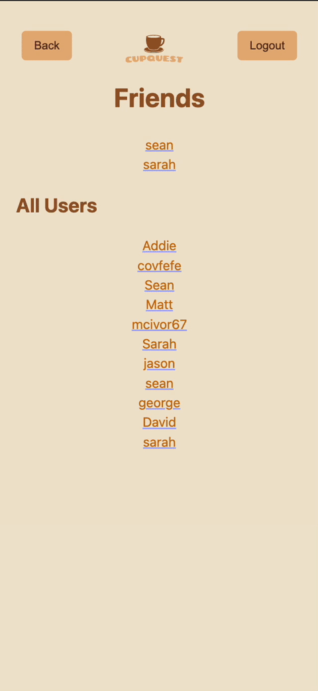
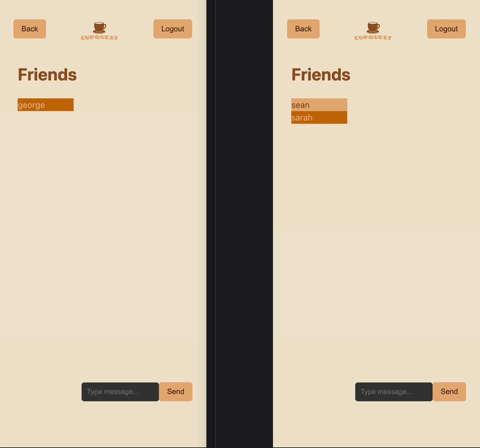

# CupQuest

## Overview
CupQuest is a mobile-based application that serves as a comprehensive guide for coffee lovers. It functions as a platform exclusively for coffee shops, allowing users to search for coffee shops in their area, read reviews, and connect with friends. The app combines data from the Google Maps API and the Yelp API to provide accurate and up-to-date information about coffee shops.

## Table of Contents
- [Features](#Features)
- [Installation](#Installation)
- [Usage](#Usage)
- [External APIs](#External-APIs)
- [Tech Stack](#Tech-Stack)
- [Further Development](#Further-Development)
- [Contributors](#Contributors)

## Features
- **User Account and Authentication**: CupQuest provides users with the ability to create their own accounts. The app utilizes Google Authentication to ensure secure and easy login for users. User information is stored in Firebase, ensuring data security.

 

- **Coffee Shop Search**: With the help of the <a href="https://developers.google.com/maps">Google Maps API</a> and the <a href="https://docs.developer.yelp.com/docs/fusion-intro">Yelp API</a>, CupQuest offers a powerful search feature that allows users to find coffee shops in their vicinity. User searches are based on location, though results can be filtered by drinks and ratings.
- **Coffee Shop Information**: Once a coffee shop is selected, CupQuest gathers detailed information from Yelp, including hours, contact information, and photos. The menu is standardized across all coffee shops with basic drinks available anywhere, but there is an option for Specialty drinks to submit reviews for more creative beverages. These menu items are displayed with their average rating from the submitted reviews.


- **Coffee Shop Reviews**: When a coffee shop is selected, users can read reviews left by other users--their friends showing first. Users can react by liking or disliking individual reviews. Users can also submit their own reviews by drink using the review submission form above the list.


- **Friends and Chat**: CupQuest allows for connecting with friends -and fellow coffee enthusiasts. Users can add and remove friends, see other users' review history, and message with friends. This feature encourages a sense of community and fosters engagement among users.




## Installation
To continue development for CupQuest, follow these steps:
1. Fork the CupQuest repository from GitHub.
2. Create a new branch for your contribution.
3. Install dependencies using NPM package manager:
```bash
npm install
```
4. Create a .env file with the following keys, sourced from the listed places:
```
# Google Maps
VITE_MAP_API_KEY=<key>

# Yelp Dev
VITE_YELP_API_KEY=<key>
VITE_YELP_CLIENT_ID=<key>

# MongoDB
DATABASE=<your MongoDB connection string>

# Firebase
VITE_FIREBASE_API=<key>
VITE_FIREBASE_AUTH_DOMAIN=<domain>
VITE_FIREBASE_PROJECT_ID=<project id>
VITE_FIREBASE_STORAGE_BUCKET=<storage bucket>
VITE_FIREBASE_MESSAGING_SENDER_ID=<messaging sender ID>
VITE_FIREBASE_APP_ID=<app ID>
VITE_FIREBASE_MEASUREMENT=<measurement>
VITE_FIREBASE_STORAGE=<storage>

# Google Authentication
VITE_GOOGLE_CLIENT_ID=<client ID>

# Server Port
PORT=3000
```
5. Then build the app using the following script. This will run Vite in watch mode, so as you make changes it will recompile upon saving.
```bash
npm run build
```
6. Then in a separate terminal window run the following command. This will run the Node.js server with Nodemon, so it restarts upon changes.
```bash
npm run server
```
* **Note:** You will have to use your own database for development purposes, but should changes be accepted your portion will integrate with the proprietary one.

## Usage
To get started with CupQuest, follow these steps:
1. Navigate to `http://localhost:3000`.
2. Make a new account, log into your existing account, or sign in with Google
3. Grant the necessary location permissions to ensure accurate search results.
4. Explore the various features of searching for coffee shops, reading reviews, and connecting with friends.
5. Customize your profile, change your profile picture, and update your preferences.

## Tech Stack & APIs

**Frontend:**


**Backend:**


**Database & Realtime:**


**Testing & Linting:**


**APIs:**
- Google Maps (via `google-maps-react`)
- Yelp Fusion endpoints:
  - `/businesses/search`
  - `/businesses/:id`
  - `/businesses/matches`

## Further Development
- Adding comment functionality to reviews
- Specified menu based on actual available items at coffee shops

## Contributors
- [Addie Lopshire-Bratt](https://github.com/addielb)
- [David Cardona](https://github.com/clothesTooLarge)
- [George Haltermann](https://github.com/Agoews)
- [Matt McIvor](https://github.com/matthewrmcivor)
- [Sarah Kay](https://github.com/ThePebbles)
- [Sean Wong](https://github.com/seanwong1)